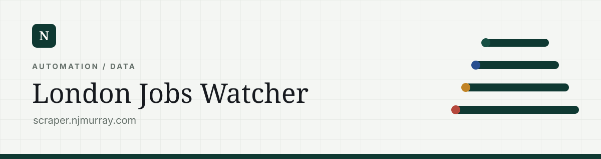
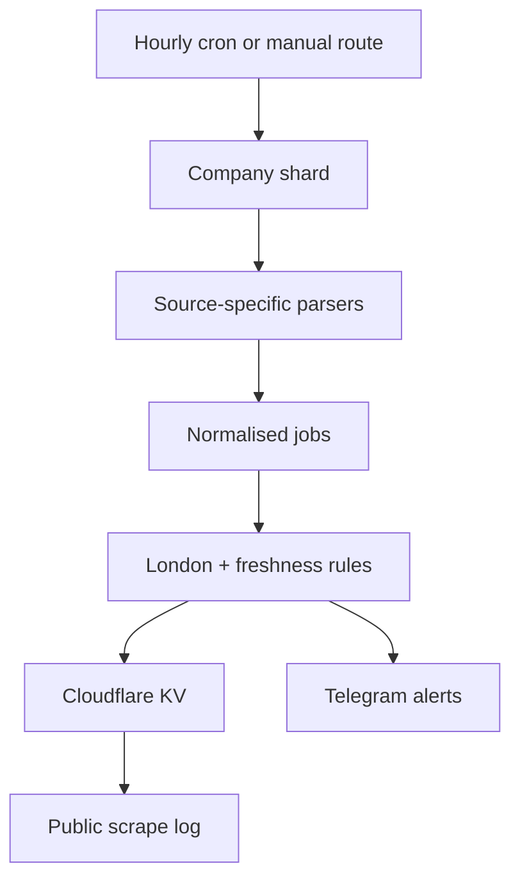

# London Jobs Watcher

Cloudflare Worker at `scraper.njmurray.com` for monitoring selected careers sources, identifying newly discovered London roles, recording discovery history, and sending Telegram alerts. The same Worker also serves a 30-day public scrape log and runs birthday/anniversary reminders.

The system is fetch-based. It does not run a headless browser, execute careers-site JavaScript, or use a relational database.

## System topology



`src/index.js` owns orchestration and external behaviour. `src/parsers.js` owns source retrieval and conversion into a shared job model. `src/companies.js` connects each company to the correct parser and its source-specific options.

## Worker entry points

The default export exposes two Cloudflare handlers:

- `fetch(request, env)` routes HTTP requests.
- `scheduled(event, env, ctx)` starts hourly background work with `ctx.waitUntil()`.

The scheduled handler runs two independent tasks in parallel:

1. one company-job shard;
2. the birthday/anniversary reminder check.

An error in either scheduled task is caught and logged without cancelling the other.

## Job-check scheduling

The cron expression in `wrangler.jsonc` is:

```text
0 * * * *
```

The enabled company list is divided into three deterministic shards. The shard index is:

```js
utcHour % 3
```

Within a shard, a company is included when:

```js
companyIndex % 3 === shardIndex
```

This spreads source requests across three hours while still checking every enabled company once per three-hour cycle. Manual routes can override the shard count and index through `shard` and `shards` query parameters.

Up to six company fetches run concurrently. `mapWithConcurrency()` preserves result order while a shared index assigns work to six asynchronous loops.

## Company registry

Each entry in `src/companies.js` contains the common fields:

```js
{
  name: "Company",
  slug: "company",
  url: "https://example.com/jobs-source",
  careersUrl: "https://example.com/careers",
  parserType: "greenhouse",
  enabled: true,
  notes: "Reason for this source and parser."
}
```

Parser-specific options can add location queries, pagination caps, alternate searches, locale values, GraphQL identifiers, office filters, or embedded-data keys.

`enabled: false` removes a source from normal and test runs without deleting its configuration or investigation notes.

## Parser dispatch

`fetchCompanyJobs()` switches on `parserType` and supports:

| Parser type | Source shape |
| --- | --- |
| `greenhouse` | Greenhouse public job-board JSON |
| `next-greenhouse` | Greenhouse data embedded in Next.js page state |
| `lever` | Lever postings API |
| `ashby` | Ashby posting API |
| `workday` | Workday CXS search API |
| `successfactors` | SAP SuccessFactors Recruiting API |
| `workable` | Workable-style job feeds |
| `icims` | iCIMS careers HTML |
| `jibe` | Jibe/iCIMS search API |
| `paradox` | Paradox careers API |
| `eightfold-embedded` | Eightfold data embedded in server-rendered HTML |
| `eightfold-pcsx` | Eightfold PCSX search API |
| `meta-graphql` | Meta careers Relay GraphQL |
| `spotify` | Life at Spotify public API |
| `apple` | Apple search hydration data |
| `revolut-next` | Revolut Next.js positions data through a fetch-only reader |
| `html` | Generic link extraction from server-rendered HTML |

The generic HTML parser is a fallback. It extracts likely job links and nearby text but is less precise than a stable JSON endpoint. Sources whose useful content exists only after client-side JavaScript execution may return zero jobs and are normally disabled until a fetchable source is found.

All network helpers use a 45-second timeout. Several request paths retry transient failures, respect short upstream retry hints where available, and send browser-like headers when a careers site requires them.

## Normalised job model

Every parser returns the same structure through `normalizeJob()`:

```js
{
  key: "company-slug::stable-source-identity",
  company: "Company",
  companySlug: "company-slug",
  title: "Role title",
  location: "London, UK",
  office: "London",
  url: "https://example.com/jobs/123",
  postedAt: "2026-07-24T00:00:00.000Z",
  closingAt: "",
  parserType: "greenhouse",
  searchText: "combined text used for location matching"
}
```

Normalisation:

- canonicalises relative and absolute URLs;
- collapses whitespace;
- creates a stable key from the company slug and source ID, falling back to URL or title/location;
- converts several source-specific date formats into a comparable form;
- ensures missing fields become empty strings rather than inconsistent `null` values.

The stable key is the core identity invariant. If a parser changes how it derives `id`, old vacancies can appear new even when the underlying role has not changed.

## London classification

`isLondonJob()` examines:

- title;
- primary location;
- office text;
- parser-specific `searchText`.

The initial positive patterns are `London`, `Greater London`, and `Hybrid London`.

Additional safeguards then apply:

1. `London, Ontario` is rejected unless UK/England/Greater London wording also appears.
2. A title or primary location containing London is accepted directly.
3. When no primary location exists, supporting office/search text may establish London.
4. When the primary location is remote, hybrid, multiple, various, or anywhere, supporting text must indicate both the UK and London.

This deliberately favours explicit London evidence over broad UK-remote wording.

## Watcher run lifecycle

`runWatcher()` follows this sequence:

1. Load `seen-jobs-v1` from the `SEEN_JOBS` KV binding.
2. Select enabled companies and the requested shard.
3. Fetch and parse companies with concurrency limited to six.
4. Keep source failures separate so one failure does not stop the run.
5. De-duplicate repeated keys within the current run.
6. Classify every parsed job as London or non-London.
7. Skip any key already present in KV.
8. Record every first-seen job, including non-London jobs.
9. Evaluate new London jobs for freshness and open/closed status.
10. Sort alertable jobs by company and title.
11. Send one or more Telegram messages when required.
12. Persist the updated KV state only when notification handling is safe.

Storing non-London jobs is intentional. If an existing role is later edited to mention London, it does not become a false “new job” alert.

## Freshness and open-role checks

When `postedAt` is available, a newly discovered London role older than 14 days is stored but not alerted. This limits noisy historical backfill after:

- adding a new company;
- fixing a parser;
- changing a stable ID;
- clearing or replacing KV data.

Most sources are treated as open when they are listed. BBC roles receive an extra detail-page check: a visible closing date earlier than the current date suppresses the alert.

If an open-role verification request itself fails, the failure is logged and the role remains alertable. This avoids dropping a likely valid role because a secondary check was temporarily unavailable.

## KV state

The main KV value is stored under `seen-jobs-v1`:

```json
{
  "version": 1,
  "updatedAt": "2026-07-24T12:00:00.000Z",
  "jobs": {
    "company::job-id": {
      "firstSeenAt": "2026-07-24T12:00:00.000Z",
      "company": "Company",
      "title": "Role title",
      "location": "London",
      "office": "London",
      "url": "https://example.com/jobs/123",
      "postedAt": "2026-07-23T00:00:00.000Z",
      "closingAt": "",
      "london": true,
      "telegramSentAt": "2026-07-24T12:00:01.000Z"
    }
  }
}
```

Legacy plain job-object data is accepted and wrapped into the version-one shape while loading.

`telegramSentAt` is applied only after all alert chunks send successfully. If Telegram was attempted and fails, the newly changed seen store is not saved. The next run can therefore rediscover and retry the alert rather than permanently suppressing it.

Manual runs can separate the two side effects:

- `notify=false` performs checks without Telegram.
- `save=false` prevents KV writes.
- combining both produces a read-only diagnostic run.

## Telegram alert behaviour

No alert is sent when there are no new London jobs and at least one company check succeeded.

A message is sent when:

- one or more new London jobs are alertable; or
- every company in the selected run failed.

Each job block contains company, title, location, and URL. Failure names are appended as a warning when a run also finds jobs.

Telegram messages are capped below the platform limit at 3,900 characters. `chunkTelegramBlocks()` keeps complete job blocks together and adds part numbering when multiple messages are required. Link previews are disabled.

The runtime configuration values are:

```text
TELEGRAM_BOT_TOKEN
TELEGRAM_CHAT_ID
TELEGRAM_WEBHOOK_SECRET
```

They are read from the Worker environment and are not stored in source files.

## Public scrape log

`/` and `/scraper` load data from KV and render HTML directly in the Worker. `/scraper.json` returns the same filtered window as JSON.

A record is included when:

1. company, title, URL, and a valid `firstSeenAt` exist;
2. it was first seen within the last 30 days;
3. it was either successfully sent to Telegram or still passes the London and freshness rules.

Results are sorted newest-first by `firstSeenAt`, then by company and title, and capped at 5,000.

The HTML contains the current records as an escaped JSON script block. Client-side JavaScript then handles keyword and company filters without additional server requests. The page is cached publicly for five minutes.

This is a discovery log, not a live vacancy-status view. A role remains visible within the window even if the source removes it after discovery.

## Birthday and anniversary subsystem

`src/birthdays.js` stores entries as:

```js
{ name: "Example", date: "24/06" }
{ name: "Example", date: "05/10", kind: "anniversary" }
```

Dates are validated as real `DD/MM` calendar dates. Missing `kind` defaults to `birthday`; an optional `label` overrides generated wording.

The reminder task runs on every hourly cron invocation but exits unless the local time in `Europe/London` is `08:00`. It checks both today and tomorrow.

De-duplication uses a separate `birthday-reminders-v1` value in the same KV namespace. Keys include the target date, timing (`today` or `tomorrow`), name, and configured date. A reminder is recorded only after Telegram succeeds.

The webhook:

1. optionally verifies `x-telegram-bot-api-secret-token`;
2. ignores updates without a text message;
3. ignores messages from any chat other than `TELEGRAM_CHAT_ID`;
4. handles birthday/event aliases by returning the next three occurrences;
5. handles `/start` and `/help`;
6. ignores unknown commands.

The next-occurrence calculation rolls events into the following year when their date has already passed.

## HTTP routes

| Route | Method | Side effects and purpose |
| --- | --- | --- |
| `/` or `/scraper` | `GET` | Render the current 30-day scrape log from KV. |
| `/scraper.json` | `GET` | Return the same public record window as JSON. |
| `/health` | `GET` | Return `OK` without touching external services. |
| `/run-now` | `GET`/`POST` | Run job checks, optionally notify and save. |
| `/test-latest-jobs` | `GET`/`POST` | Parse sources and send the latest London job per company without changing seen-job KV. |
| `/test-telegram` | `GET`/`POST` | Send a simple Telegram test message. |
| `/run-birthday-reminders` | `GET`/`POST` | Run or preview the birthday reminder calculation. |
| `/debug-seen` | `GET` | Return the KV count and up to 100 recent records. |
| `/telegram-webhook` | `POST` | Receive authenticated Telegram bot commands. |

Useful query parameters:

| Parameter | Route | Meaning |
| --- | --- | --- |
| `notify=false` | `/run-now`, birthday route | Suppress Telegram. |
| `save=false` | `/run-now` | Suppress seen-job KV writes. |
| `shard=0&shards=3` | job routes | Run a specific valid shard. |
| `includeDisabled=true` | latest-jobs test | Include disabled company definitions. |
| `date=YYYY-MM-DD` | birthday route | Calculate against a chosen date. |
| `force=true` | birthday route | Ignore previous reminder de-duplication. |
| `limit=25` | `/debug-seen` | Limit returned records, clamped to `1–100`. |

## Failure model

- A company parser failure becomes structured run data and does not stop other companies.
- A missing KV binding stops routes that require state with a clear configuration error.
- Invalid JSON or unsupported KV shapes are rejected instead of silently resetting history.
- A Telegram failure produces a `502` on manual notification routes and prevents unsafe seen-state persistence.
- Public page rendering depends only on KV, not on careers sites or Telegram.
- Birthday and job scheduled tasks catch and log their failures independently.

## File map

| File | Responsibility |
| --- | --- |
| `src/index.js` | HTTP routing, cron orchestration, sharding, concurrency, KV state, alert decisions, Telegram, public HTML/JSON, and reminders. |
| `src/companies.js` | Company sources, parser selection, source-specific options, enable switches, and investigation notes. |
| `src/parsers.js` | Fetching, retries, source parsers, date/URL normalisation, London classification, and open-role verification. |
| `src/birthdays.js` | Birthday and anniversary source data. |
| `scripts/set-telegram-webhook.mjs` | Webhook registration and bot command publication. |
| `scripts/get-telegram-chat-id.mjs` | Chat-ID discovery helper. |
| `wrangler.jsonc` | Worker entry point, custom domain, hourly cron, and KV binding. |

## Change map

| Change | Main location |
| --- | --- |
| Add, pause, or repair a company | `src/companies.js` |
| Add a new source type | parser function plus `fetchCompanyJobs()` dispatch in `src/parsers.js` |
| Change London inclusion rules | `isLondonJob()` |
| Change stable job identity | the relevant parser and `normalizeJob()` |
| Change check cadence or shard count | `wrangler.jsonc` and `SCHEDULED_COMPANY_SHARDS` |
| Change fetch concurrency | `COMPANY_FETCH_CONCURRENCY` |
| Change alert freshness | `MAX_ALERT_JOB_AGE_DAYS` |
| Change public history window | `PUBLIC_SCRAPER_WINDOW_DAYS` |
| Change message format | Telegram formatting functions in `src/index.js` |
| Change reminder hour or timezone | reminder constants at the top of `src/index.js` |
| Add or edit a personal date | `src/birthdays.js` |

## Design constraints

- Parsers must remain fetch-based to fit the Cloudflare Worker runtime.
- Careers sources are external and can change without notice; `notes` in the company registry are part of the maintenance record.
- A stable source ID is more important than a pretty URL because it controls de-duplication.
- KV stores the complete seen history as one JSON object. This is simple but will eventually need partitioning if the history becomes very large.
- The public page reflects first discovery, not continuous proof that every role is still open.
